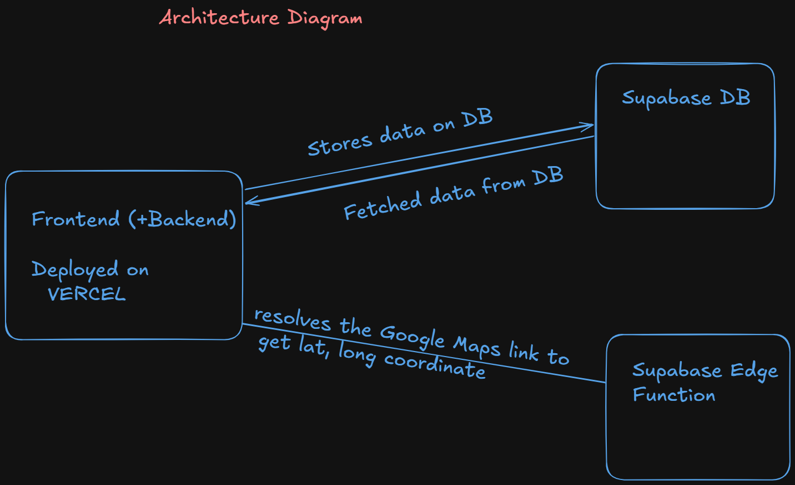
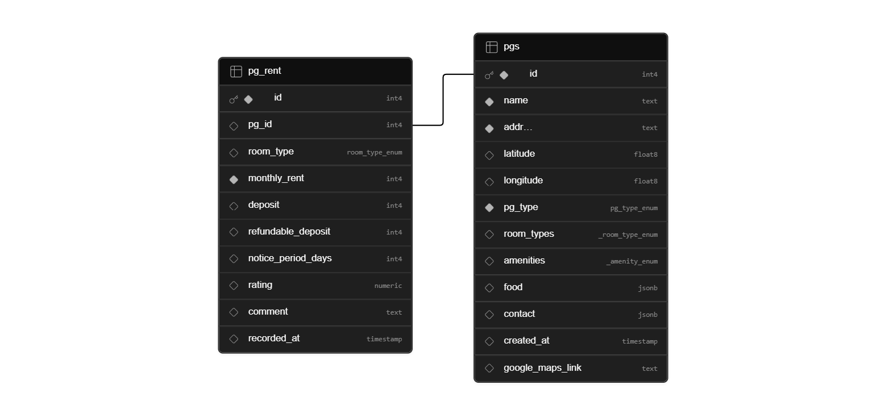
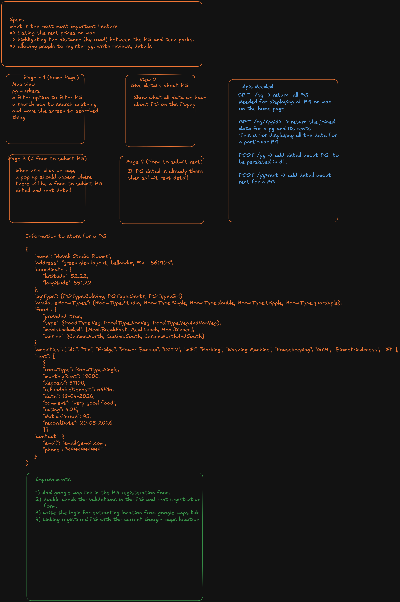

# Bengaluru PG Rent

A premium, interactive platform for discovering and managing PG (Paying Guest) accommodations in Bengaluru. This application features a robust Google Maps integration, allowing users to visualize PG locations, filter by preferences, and contribute by registering new properties.

## 🚀 Overview

Bengaluru PG Rent is designed to simplify the house-hunting process for young professionals and students in Bengaluru. It provides a visual, map-centric interface where users can quickly identify available PGs, view detailed rent structures, and see proximity to key landmarks or tech parks.

## 🏗️ System Architecture

The application is built using a modern, scalable stack that leverages serverless technologies for high availability and performance.

### Key Components:
- **Frontend**: Built with **React** and **Vite**, providing a fast and responsive user experience. It is deployed on **Vercel** for seamless global delivery.
- **Backend (Supabase)**: Utilizes **Supabase DB** (PostgreSQL) for real-time data storage and retrieval.
- **Edge Functions**: Custom **Supabase Edge Functions** handle complex tasks such as resolving shortened Google Maps links into precise latitude/longitude coordinates.

## 📊 Database Schema

The data model is optimized for tracking property details and historical rent variations over time.

### Core Tables:
- **`pgs`**: Stores primary property information including location, amenities, and contact details.
- **`pg_rent`**: A related table that tracks rent history, room types, deposits, and user ratings for each property. This allows for a detailed view of how pricing evolves.

## 📝 Specifications & Roadmap

The project was founded on clear functional requirements designed to solve real-world problems for renters.

### Key Features:
- **Map-based Discovery**: Visualize rent prices directly on the map for quick comparison.
- **Smart Search**: Integrated Google Places API for navigating to specific areas or landmarks.
- **Automated Location Entry**: Users can simply paste a Google Maps link, and the system automatically extracts coordinates using our custom Edge Function.
- **Transparent Reviews**: Users can see ratings and comments from previous or current residents.

## 🛠️ Tech Stack

- **Frontend**: React, Google Maps JS API, Lucide Icons
- **Styling**: Vanilla CSS (Modern Design System)
- **Database**: Supabase (PostgreSQL)
- **Functions**: Deno (Supabase Edge Functions)
- **Deployment**: Vercel

---
Developed with ❤️ for the Bengaluru community.
